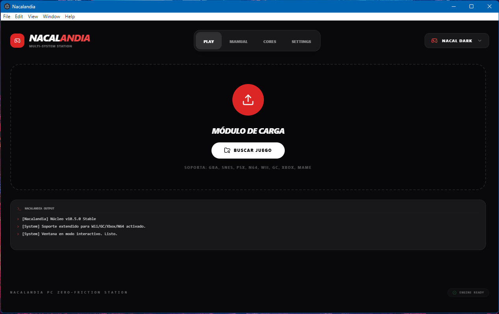
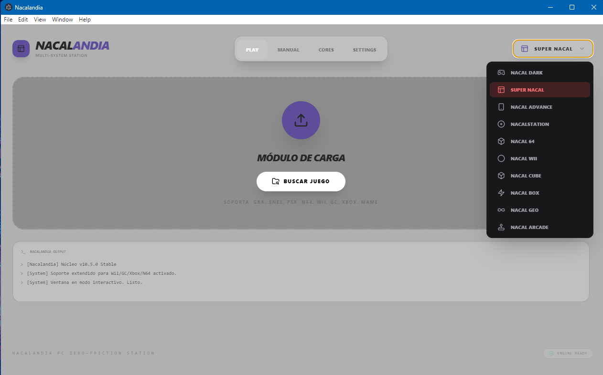
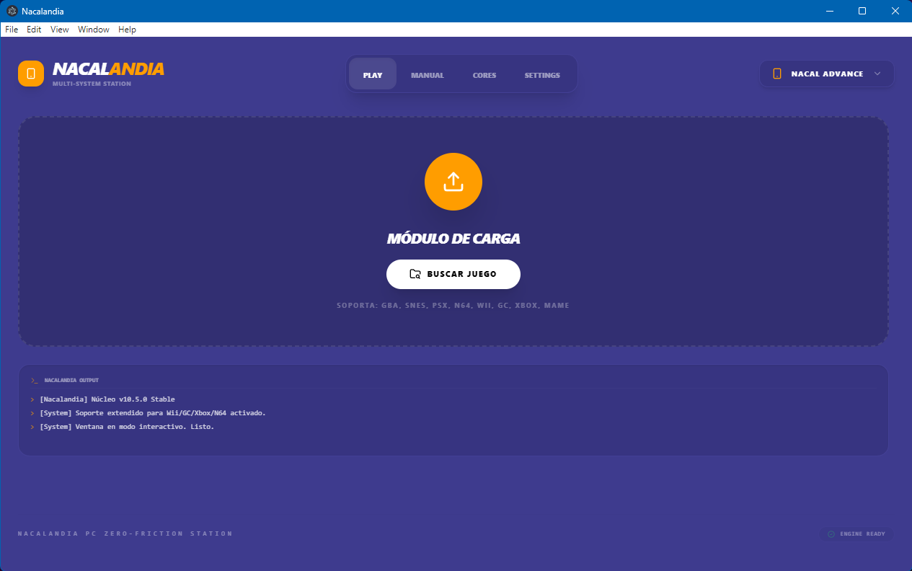
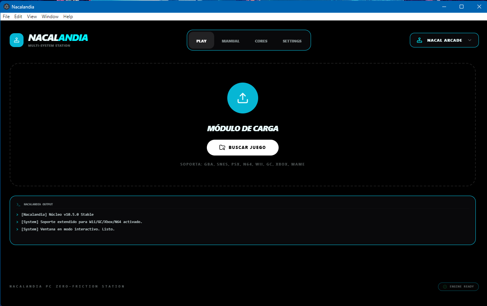
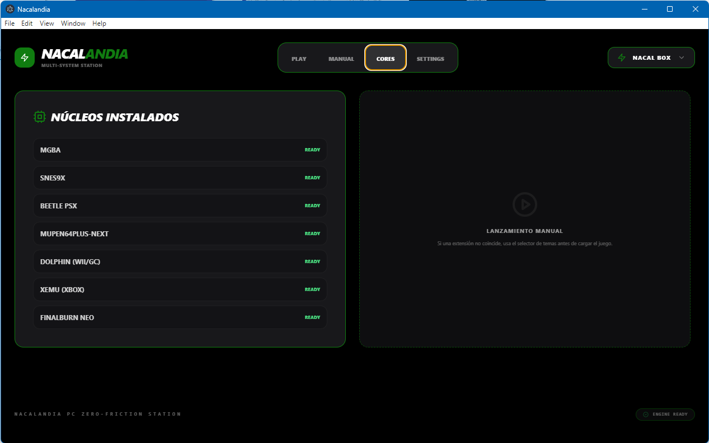

🎮 Nacalandia: Portable Multi-Console HubCustom Gaming Dashboard | Emulation & System OptimizationNacalandia es un ecosistema portable diseñado para centralizar la experiencia de retro-gaming. Este proyecto combina la potencia de sistemas como RetroArch y Conda con una personalización estética y funcional única basada en React y Electron.🖼️ Media & InterfaceAquí podés ver la interfaz personalizada de Nacalandia funcionando en alta resolución, destacando la curaduría visual y la organización de sistemas.Dashboard Principal - Acceso Rápido y Módulo de Carga Nativo

🚀 Características PrincipalesMulti-Sistema: Integración fluida de múltiples emuladores (N64, Wii, GameCube, Xbox, NeoGeo, MAME, GBA, SNES) en una sola interfaz.Portabilidad Total: Configurado para ejecutarse desde cualquier unidad externa sin necesidad de instalación ni rastro en el registro de Windows.Custom UI/UX: Interfaz dinámica que adapta su paleta de colores y componentes según la consola detectada.Búsqueda Nativa: Integración con el explorador de archivos de Windows para una carga de ROMs robusta.Optimización de Rendimiento: Inyección directa en entornos Conda aislados para evitar conflictos de librerías.🛠️ Stack Tecnológico📂 Estructura del ProyectoConfig/: Archivos de configuración .cfg optimizados para baja latencia.Scripts/: Automatizaciones en .bat y Python para la gestión de procesos.Themes/: Definiciones visuales y Rices exclusivos.Runtime/: Entorno Conda portátil (nacal_env).Emulator/: Binarios y núcleos de emulación.⚙️ Optimización y Configuración (Point 1)Para garantizar una experiencia fluida, Nacalandia utiliza configuraciones personalizadas que priorizan la latencia mínima y el escalado de video por hardware (Vulkan).Ejemplo de optimización en nacalandia_optimized.cfg:video_driver = "vulkan"
video_vsync = "true"
video_hard_sync = "true"
video_frame_delay = 0
savestate_auto_save = "true"
⚡ Automatización de Arranque (Point 2)El sistema incluye un lanzador automatizado que verifica la integridad del entorno antes de iniciar la interfaz de usuario.Script de inicio rápido (start_nacalandia.bat):@echo off
echo [SYSTEM] Iniciando Nacalandia Retro Hub...
if not exist ".\runtime\envs\nacal_env" (
    echo [ERROR] Entorno Conda no detectado.
    pause
    exit
)
start "" ".\dist_electron\Nacalandia.exe"
exit
📖 Mi VisiónNacalandia nació de la pasión por el Retro-Gaming y la necesidad de tener una estación de juego que sea tan potente como estética. Es la unión definitiva entre el software de emulación avanzado y la personalización extrema de sistemas.Nacal Team | 2026
## 📸 Media & Interface

Aquí podés ver la interfaz personalizada de **Nacalandia** funcionando en alta resolución, destacando la curaduría visual y la organización de sistemas.

  
   <i>Dashboard Principal - Acceso Rápido</i>

  
   <i>Selección de Sistemas Retro</i>

  
   <i>Custom Theme & Rices GBA</i>

  
   <i>Custom Theme & Rices MAME</i>

  
   <i>Integrated Cores & System Info</i>

---
